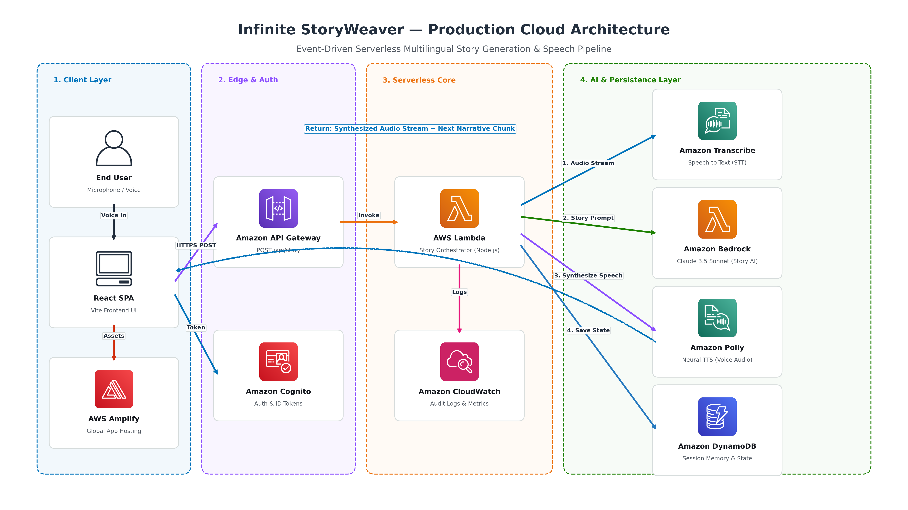

# 📖 Infinite StoryWeaver

> **Interactive Multi-Modal AI Storytelling Engine powered by AWS Bedrock & Polly**

[](https://main.deflxt16ejo0i.amplifyapp.com)
[](https://aws.amazon.com/bedrock/)
[](https://aws.amazon.com/polly/)
[](https://aws.amazon.com/dynamodb/)
[](https://aws.amazon.com/lambda/)
[](https://react.dev/)
[](https://vitejs.dev/)
[](https://tailwindcss.com/)

---

## 🌟 1. Project Title & Tagline

**Infinite StoryWeaver** is an immersive, multi-modal, voice-interactive narrative universe. Combining the ultra-low latency reasoning of **Amazon Bedrock (Amazon Nova Micro)** with the emotive, lifelike speech synthesis of **Amazon Polly (Neural TTS)** and stateful persistence in **Amazon DynamoDB**, Infinite StoryWeaver puts the user at the helm of an ever-unfolding, bespoke adventure where every choice and spoken word directly shapes their journey.

---

## 🎯 2. Overview & Problem Statement

### The Problem
Traditional interactive digital fiction (like text-based RPGs or "Choose Your Own Adventure" books) suffers from three fundamental bottlenecks:
1. **Static, Pre-scripted Branching:** Decision trees are hard-coded and limited by developer time, causing players to hit predictable narrative dead ends.
2. **Text-Heavy Cognitive Strain:** Most generative storytelling apps are strictly text-based walls of prose without dynamic multi-sensory immersion or narration.
3. **Loss of Conversational Memory:** Simple AI chat interfaces quickly lose context, hallucinate past decisions, or require heavy, expensive token reprocessing across turns.

### The Solution: Infinite StoryWeaver
**Infinite StoryWeaver** bridges conversational voice AI, generative reasoning, and low-latency cloud infrastructure:
- **Spoken or Typed Exploration:** Players speak directly into their microphone or type interactive commands to resolve high-stakes dilemmas.
- **Dynamic Prose & Cliffhangers:** Amazon Bedrock crafts vivid, genre-accurate narrative scenes that culminate in dramatic decision points.
- **Lifelike Neural Audio Narration:** Stories are spoken aloud in real-time with pitch- and speed-modulated Neural voice synthesis matching the emotional tone (e.g. suspenseful whispers vs. vibrant children's tales).
- **Persistent Session State:** Amazon DynamoDB preserves the conversational timeline across turns, allowing players to build continuous chronicles.

---

## ⚡ 3. Key Features

- 🎭 **Dynamic Multi-Modal Narrative Generation:** Powered by **Amazon Bedrock (Nova Micro)** using AWS Converse API to produce multi-turn, coherent narrative arcs complete with cliffhanger choices.
- 🎙️ **Dual-Mode Voice & Text Input:** Seamlessly switch between hands-free voice commands (using the HTML5 Web Speech API with automatic fallback mechanisms) and rapid text typing.
- 🔊 **Neural Voice Playback & Tone Modulation:** Real-time synthesis powered by **Amazon Polly Neural Engine** featuring voice gender selection (Matthew & Ruth) and SSML prosody rate adjustments (`natural`, `scary / spooky` at 75% rate, and `children / playful` at 115% rate).
- 🧠 **Persistent Session Memory:** Amazon DynamoDB documents full conversational history per unique session, enabling continuous continuity across story iterations.
- 🌐 **Multi-Genre & Multi-Language Support:** Instant adaptation across 5 core genres (*Fantasy, Sci-Fi, Mystery, Cyberpunk, Horror*) and multiple locales (*English `en-US`, Spanish `es-ES`, French `fr-FR`*).
- 🔁 **Audio Replay Controls:** In-line replay buttons allow users to re-listen to any previously generated narrative segment on demand.
- 💎 **Cyber-Slate Aesthetics:** Built with a dark, glassmorphic UI, responsive audio visualizers, and glowing interaction feedback powered by Tailwind CSS v4 and Lucide icons.

---

## 🚀 4. Live Demo & Architecture

### 🔗 Live Deployments
* **Production Web App (AWS Amplify):** [https://main.deflxt16ejo0i.amplifyapp.com](https://main.deflxt16ejo0i.amplifyapp.com)
* **Serverless Backend (AWS Lambda Function URL):** `https://mrybogha2useb6wj26tzathdku0knzgg.lambda-url.ap-south-1.on.aws`

---

### 🏛️ System Architecture Diagram

<p align="center">
  
  <br />
  <em>Figure 1: Infinite StoryWeaver Event-Driven Serverless Multilingual Story Generation & Speech Pipeline Architecture</em>
</p>

---

## 🛠️ 5. Tech Stack Breakdown

### Frontend
| Technology | Version | Purpose |
| :--- | :--- | :--- |
| **React** | `19.2.8` | Component-driven UI framework with responsive state management |
| **Vite** | `8.3.0` | Ultra-fast next-generation frontend tooling and bundler |
| **Tailwind CSS** | `4.3.3` | Modern utility-first CSS engine for dark-mode glassmorphism |
| **Lucide React** | `^1.47.0` | Crisp, accessible iconography (Mic, Volume, Sparkles, Book) |
| **Web Speech API** | Native | In-browser speech-to-text with mockable fallback harness |
| **Canvas Confetti**| `^1.9.4` | Milestone and reward visual celebrations |

### Backend
| Technology | Version | Purpose |
| :--- | :--- | :--- |
| **Node.js** | `20.x` ES Modules | Asynchronous server runtime |
| **Express.js** | `5.2.1` | REST API routing and payload parsing middleware |
| **@vendia/serverless-express** | `^4.12.6` | Seamless translation between Lambda events and Express |
| **AWS SDK for JavaScript v3** | `^3.1138.0` | Modular, low-footprint SDK clients for Bedrock, Polly, & DynamoDB |
| **dotenv** | `^18.0.3` | Environment variable management across local and cloud environments |
| **CORS** | `^2.8.6` | Cross-Origin Resource Sharing handling for cloud integrations |

### AWS Cloud & AI Services
| AWS Service | Component Details | Functionality |
| :--- | :--- | :--- |
| **Amazon Bedrock** | `amazon.nova-micro-v1:0` | Fast, cost-efficient generative AI storytelling via Converse API |
| **Amazon Polly** | Neural Engine (`Matthew`, `Ruth`) | Lifelike speech synthesis with dynamic SSML prosody rate adjustments |
| **Amazon DynamoDB** | `StoryWeaverSessions` Table | High-throughput, low-latency NoSQL persistence for story trees |
| **AWS Lambda** | Node 20.x Function URL | Serverless execution without API Gateway overhead |
| **AWS Amplify** | Hosting & CI/CD pipeline | Automatic Git-triggered frontend builds and global edge CDN |
| **Amazon CloudWatch** | CloudWatch Logs | Real-time monitoring, error logging, and latency tracing |
| **AWS IAM** | Custom Execution Role | Least-privilege role scoping access strictly to required services |

---

## 📂 6. Project Structure

```bash
infinite-storyweaver/
├── .env                              # Root local environment configuration
├── .gitignore                        # Git exclusion rules (node_modules, dist, secrets)
├── generate_diagram.py               # Cloud architecture diagram generator
├── README.md                         # Comprehensive project documentation
├── docs/
│   └── architecture-diagram.png      # High-resolution architectural diagram
├── icons/                            # Official AWS and architecture icon assets
│
├── backend/                          # Serverless Node.js Express Backend
│   ├── package.json                  # Backend dependencies & script definitions
│   ├── package-lock.json             # Exact dependency lockfile
│   ├── qa_verification.js            # Automated end-to-end QA verification test suite
│   └── src/
│       ├── index.js                  # Express API, Bedrock/Polly/DynamoDB orchestration
│       └── lambda.js                 # Serverless-express Lambda handler entrypoint
│
└── frontend/                         # Vite + React 19 Frontend SPA
    ├── index.html                    # Single Page Application HTML root
    ├── vite.config.js                # Vite build and plugin configurations
    ├── tailwind.config.js            # Tailwind styling configurations
    ├── eslint.config.js              # Code linting specifications
    ├── package.json                  # Frontend dependencies & scripts
    └── src/
        ├── main.jsx                  # React application entry point
        ├── App.jsx                   # Main interactive narrative interface & state logic
        ├── App.css                   # Custom transitions and UI styles
        ├── index.css                 # Base Tailwind styling imports
        └── assets/                   # Static visual assets
```

---

## 💻 7. Local Development Guide

### Prerequisites
* **Node.js**: `v18.x` or `v20.x` installed
* **npm**: `v9.x` or higher
* **AWS Account**: With configured AWS CLI credentials (`aws configure`) having permissions for Bedrock, Polly, and DynamoDB.

---

### Step 1: Clone the Repository
```bash
git clone https://github.com/poornabhagya/infinite-storyweaver.git
cd infinite-storyweaver
```

---

### Step 2: Configure Environment Variables

Create a `.env` file in the project root:
```env
AWS_REGION=ap-south-1
DYNAMODB_TABLE=StoryWeaverSessions
PORT=5000
```

> **Note:** Amazon Bedrock Nova Micro is invoked via `us-east-1` in `backend/src/index.js`, while DynamoDB and Polly default to your active region (e.g., `ap-south-1`). Ensure your AWS CLI credentials have access to Bedrock in `us-east-1`.

---

### Step 3: Setup & Run the Backend
```bash
# Navigate to backend directory
cd backend

# Install dependencies
npm install

# Start development server
node src/index.js
```
*Backend will be running at:* `http://localhost:5000`  
*Health Check:* `http://localhost:5000/`

---

### Step 4: Run the Backend QA Suite
To verify Bedrock Converse, Polly Neural TTS, voice tones, and DynamoDB multi-turn session persistence locally:
```bash
node qa_verification.js
```

---

### Step 5: Setup & Run the Frontend
Open a new terminal window:
```bash
# Navigate to frontend directory
cd frontend

# Install dependencies
npm install

# Start Vite development server
npm run dev
```
*Frontend will be running at:* `http://localhost:5173`

---

## ☁️ 8. Deployment Architecture

### 1. Serverless Backend Deployment (AWS Lambda)
The backend is packaged and deployed as a serverless container/zip function on AWS Lambda using `@vendia/serverless-express`:

```bash
# From the backend directory:
npm install --production
zip -r ../lambda_backend.zip . -x "*.git*" "qa_verification.js"
```

1. **Lambda Function Configuration:**
   - **Runtime:** `Node.js 20.x`
   - **Handler:** `src/lambda.handler`
   - **Memory:** `512 MB`
   - **Timeout:** `30 seconds` (to accommodate generative token streaming and audio synthesis)
   - **Environment Variables:**
     - `AWS_REGION`: `ap-south-1`
     - `DYNAMODB_TABLE`: `StoryWeaverSessions`
     - `NODE_ENV`: `production`

2. **Function URL Configuration:**
   - Auth Type: `NONE` (Publicly accessible for web clients)
   - CORS Enabled:
     - `Allow-Origin`: `*` (or your Amplify domain: `https://main.deflxt16ejo0i.amplifyapp.com`)
     - `Allow-Methods`: `GET, POST, OPTIONS`
     - `Allow-Headers`: `Content-Type, Authorization`

---

### 2. Frontend CI/CD Deployment (AWS Amplify)
The React application is continuously built and served via **AWS Amplify Hosting**:
- **Framework:** `Vite / React`
- **Build Settings (`amplify.yml`):**
  ```yaml
  version: 1
  frontend:
    phases:
      preBuild:
        commands:
          - cd frontend
          - npm ci
      build:
        commands:
          - npm run build
    artifacts:
      baseDirectory: frontend/dist
      files:
        - '**/*'
    cache:
      paths:
        - frontend/node_modules/**/*
  ```
- Any commit pushed to the `main` branch automatically triggers an optimized production build deployed across global CloudFront edge locations.

---

## 🔒 9. Security & IAM Policies

The Lambda backend executes under an IAM Role structured following the principle of **least-privilege**:

```json
{
  "Version": "2012-10-17",
  "Statement": [
    {
      "Sid": "BedrockConverseAccess",
      "Effect": "Allow",
      "Action": [
        "bedrock:Converse"
      ],
      "Resource": "arn:aws:bedrock:us-east-1::foundation-model/amazon.nova-micro-v1:0"
    },
    {
      "Sid": "PollyNeuralSpeechAccess",
      "Effect": "Allow",
      "Action": [
        "polly:SynthesizeSpeech"
      ],
      "Resource": "*"
    },
    {
      "Sid": "DynamoDBSessionStoreAccess",
      "Effect": "Allow",
      "Action": [
        "dynamodb:GetItem",
        "dynamodb:PutItem"
      ],
      "Resource": "arn:aws:dynamodb:*:*:table/StoryWeaverSessions"
    },
    {
      "Sid": "CloudWatchLogsAccess",
      "Effect": "Allow",
      "Action": [
        "logs:CreateLogGroup",
        "logs:CreateLogStream",
        "logs:PutLogEvents"
      ],
      "Resource": "arn:aws:logs:*:*:*"
    }
  ]
}
```

### Security Safeguards Implemented
- **SSML Injection Sanitization:** Prior to invoking Polly, narrative text is sanitized against rogue XML tags (`<`, `>`, `&`, `"`, `'`) to prevent SSML injection vulnerabilities while preserving prosody tags.
- **Payload Bounds:** Request bodies are size-constrained to prevent denial-of-service memory exhausts.
- **Zero Hardcoded Secrets:** No AWS Access Keys or Secret Keys exist in code; authentication is handled via IAM instance profiles and Lambda execution roles.

---

## 🗺️ 10. Future Roadmap & Hackathon Submission Info

### 🏆 AWS "Zero to Shipped" Hackathon Submission
* **Category:** Generative AI & Serverless Applications
* **Author:** Poorna Bhagya ([@poornabhagya](https://github.com/poornabhagya))
* **Repository:** [https://github.com/poornabhagya/infinite-storyweaver](https://github.com/poornabhagya/infinite-storyweaver)
* **Live Application:** [https://main.deflxt16ejo0i.amplifyapp.com](https://main.deflxt16ejo0i.amplifyapp.com)

### 🚀 Future Roadmap
- [ ] **Dynamic Scene Illustration:** Integrate **Amazon Titan Image Generator** via Bedrock to illustrate pivotal story scenes alongside audio narration.
- [ ] **Multiplayer Party Mode:** Real-time collaborative storytelling rooms powered by **AWS AppSync** and WebSockets.
- [ ] **Branching Story Map Visualizer:** An interactive node-graph allowing players to rewind, branch, and inspect alternate narrative timelines.
- [ ] **Personalized Voice Cloning:** Amazon Polly custom voice models to let users hear adventures narrated in their own voice.
- [ ] **Audio Export:** One-click download of the generated story as an MP3 audiobook chronicle.

---

## 📜 License
Distributed under the **ISC License**. See `LICENSE` for more information.

---

<p align="center">
  Crafted with ❤️ for the <strong>AWS Zero to Shipped Hackathon</strong> using <strong>Amazon Bedrock</strong> & <strong>Amazon Polly</strong>.
</p>
